# RxVerify Architecture Documentation

> **Comprehensive technical architecture and system design for RxVerify - Post-Discharge Medication Search & Feedback-Driven ML System**

## 🏗️ **System Architecture Overview**

RxVerify is built as a modern, production-ready medication search system designed specifically for post-discharge medication management. It combines real-time API integration, intelligent feedback-driven learning, and comprehensive admin analytics for continuous system optimization.

## 🔄 **High-Level System Flow**

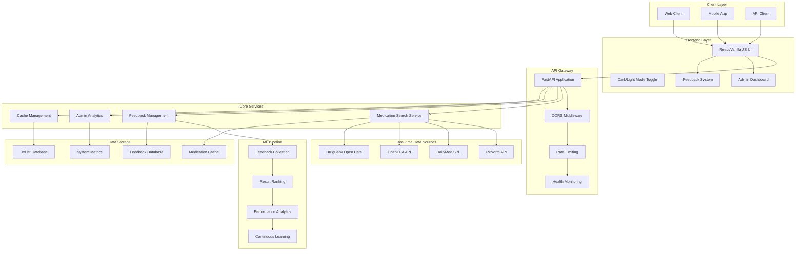

## 🧠 **Core Application Architecture**

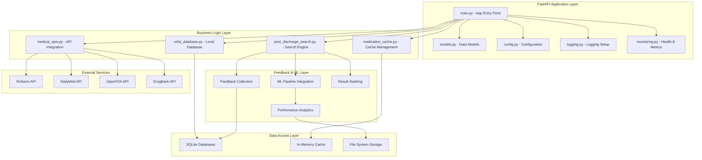

## 🔍 **Medication Search Flow**

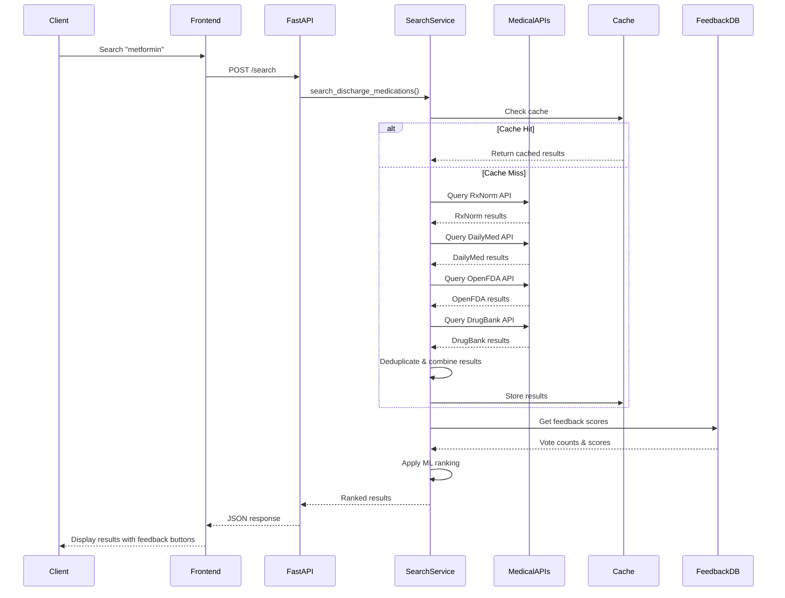

## 🤖 **Feedback System Flow**

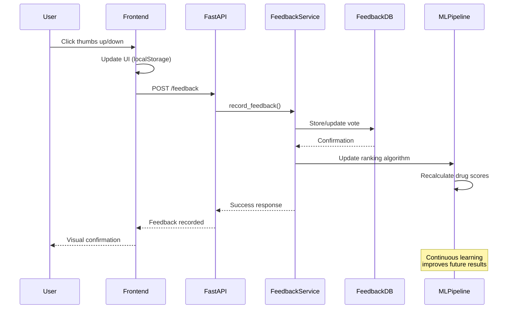

## 📊 **Admin Dashboard & Analytics**

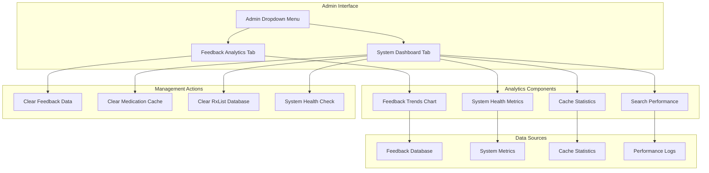

## 🔍 **Query Processing Flow**

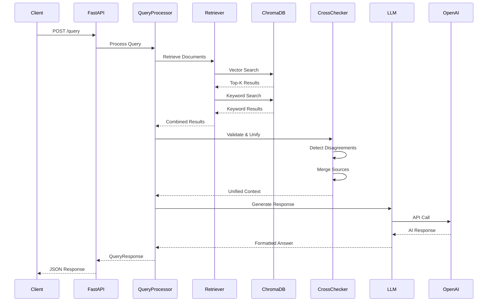

## 🗄️ **Data Architecture & Storage**

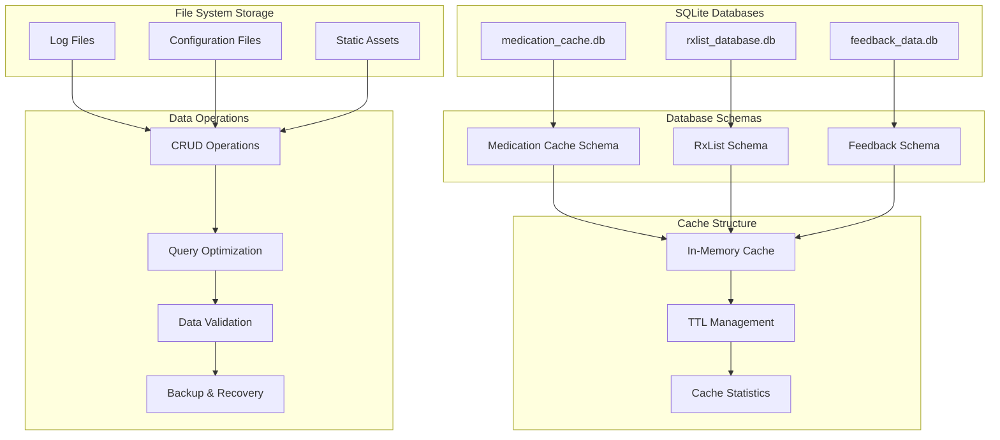

## 🔄 **Real-time API Integration Pipeline**

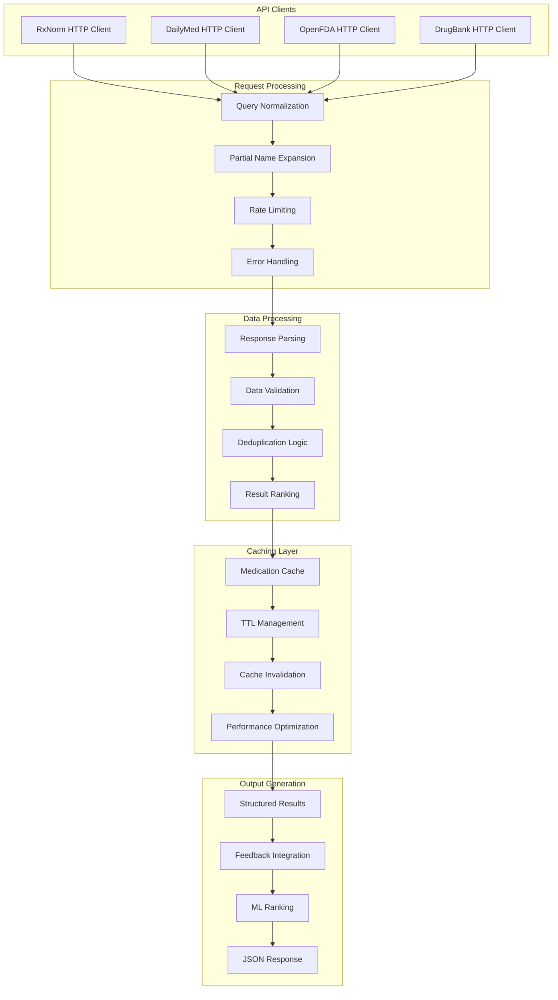

## 🚀 **Deployment Architecture**

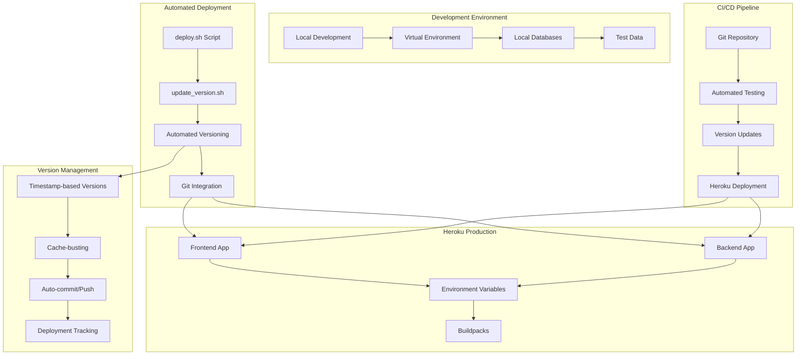

## 🔐 **Security & Access Control**

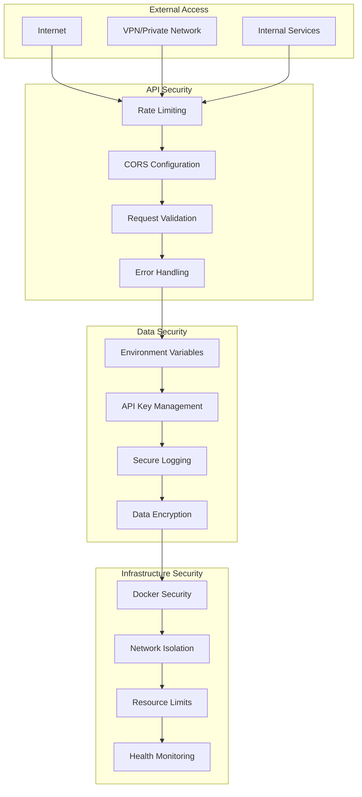

## 📊 **Monitoring & Observability**

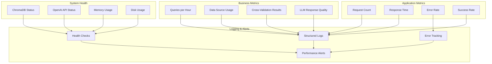

## 🚀 **Deployment Architecture**

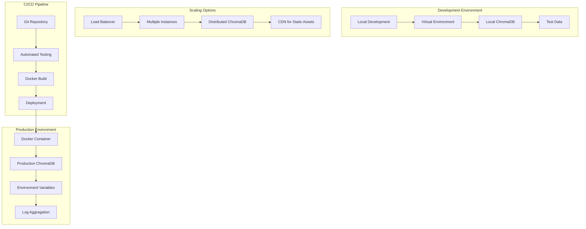

## 🔧 **Component Dependencies**

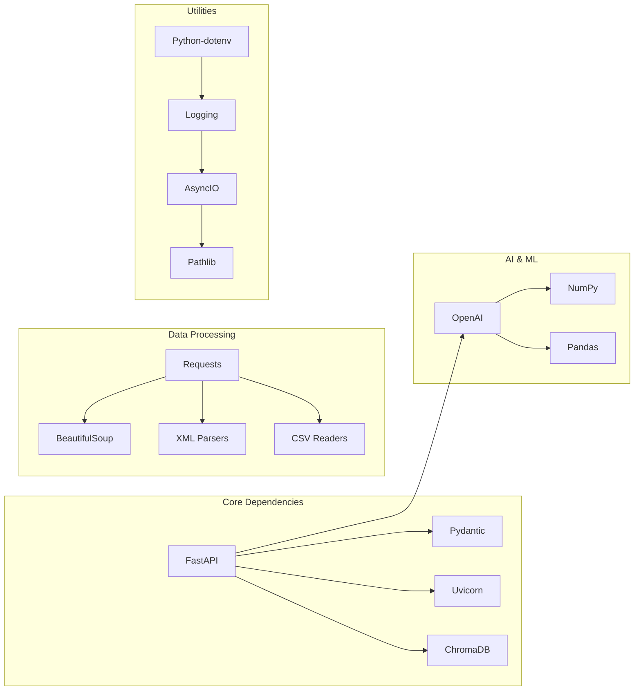

## 📈 **Performance Characteristics**

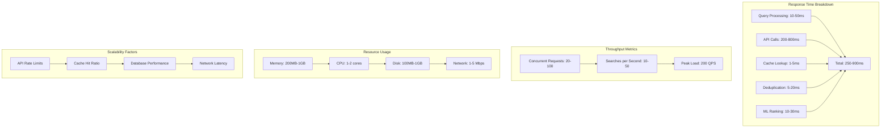

## 🔄 **Data Flow Patterns**

```mermaid
graph TB
    subgraph "Read Pattern"
        A[Query Request]
        B[Vector Search]
        C[Result Ranking]
        D[Context Assembly]
        E[Response Generation]
    end
    
    subgraph "Write Pattern"
        F[Data Ingestion]
        G[Text Processing]
        H[Embedding Generation]
        I[Vector Storage]
        J[Metadata Indexing]
    end
    
    subgraph "Update Pattern"
        K[Data Refresh]
        L[Incremental Updates]
        M[Version Management]
        N[Rollback Capability]
    end
    
    subgraph "Delete Pattern"
        O[Data Archival]
        P[Soft Deletes]
        Q[Cleanup Jobs]
        R[Storage Optimization]
    end
    
    A --> B
    B --> C
    C --> D
    D --> E
    
    F --> G
    G --> H
    H --> I
    I --> J
    
    K --> L
    L --> M
    M --> N
    
    O --> P
    P --> Q
    Q --> R
```

## 🎯 **Key Design Principles**

### **1. Real-time Data Integration**
- **Live API Queries**: Direct integration with medical databases for current information
- **Intelligent Caching**: Smart caching strategies to balance freshness and performance
- **Partial Name Support**: Automatic expansion of common drug prefixes for better UX
- **Deduplication Logic**: Combines duplicate results with different dosages

### **2. Feedback-Driven Learning**
- **User Feedback Collection**: Thumbs up/down voting system for continuous improvement
- **ML Pipeline Integration**: Feedback feeds into result ranking and optimization
- **Real-time Analytics**: Admin dashboard with feedback trends and system metrics
- **Performance Tracking**: Comprehensive monitoring of search quality and user satisfaction

### **3. Post-Discharge Focus**
- **Curated Results**: Prioritizes oral medications typically prescribed after hospital stays
- **Clinical Relevance**: Filters out IV medications, formulas, and non-discharge medications
- **RxCUI Integration**: Direct links to authoritative drug information sources
- **Comprehensive Information**: Drug class, common uses, and dosage information

### **4. Modern User Experience**
- **Responsive Design**: Optimized for desktop, tablet, and mobile devices
- **Dark/Light Mode**: System preference detection with manual override
- **Progressive Web App**: PWA capabilities with offline support
- **Real-time Feedback**: Live vote counts and visual feedback on interactions

### **5. Production-Ready Architecture**
- **Automated Deployment**: Scripted deployment with version management
- **Health Monitoring**: Comprehensive system status and performance metrics
- **Error Handling**: Graceful degradation and comprehensive error reporting
- **Scalable Design**: Architecture supports horizontal scaling and load balancing

## 🔮 **Future Architecture Considerations**

### **Scalability Enhancements**
- **Load Balancing**: Multiple API instances behind a load balancer
- **Database Clustering**: Distributed SQLite or PostgreSQL clusters
- **Caching Layer**: Redis for frequently accessed data and session management
- **CDN Integration**: Static asset delivery optimization

### **Advanced Features**
- **Real-time Updates**: WebSocket support for live data updates and notifications
- **Advanced Analytics**: Machine learning for search result optimization
- **Multi-tenant Support**: Isolated data spaces for different organizations
- **API Versioning**: Backward-compatible API evolution

### **Integration Capabilities**
- **EHR Integration**: Direct integration with Electronic Health Records
- **Pharmacy Software**: Integration with pharmacy management systems
- **Mobile SDKs**: Native mobile application support
- **Third-party APIs**: Integration with additional medical data sources

### **AI/ML Enhancements**
- **Natural Language Processing**: Advanced query understanding and intent recognition
- **Predictive Analytics**: Anticipate user needs and suggest relevant medications
- **Personalization**: User-specific result ranking based on history and preferences
- **Automated Quality Assurance**: AI-powered result validation and quality scoring

---

*This architecture document provides a comprehensive view of the RxVerify system design. For implementation details, refer to the individual component documentation and source code.*
