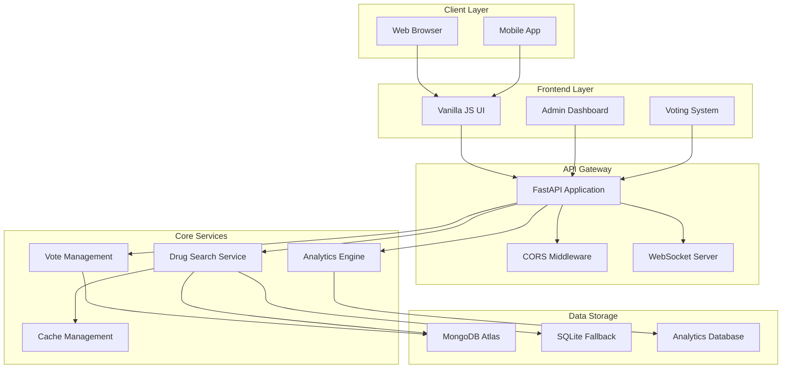
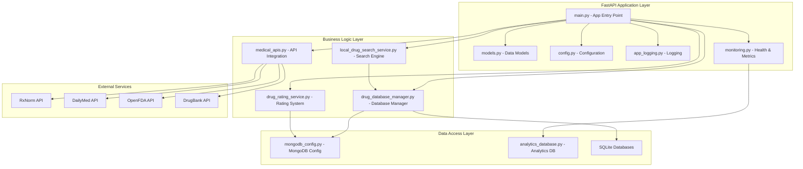
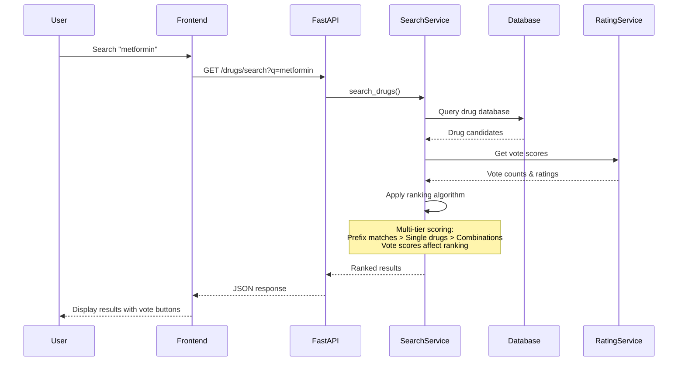
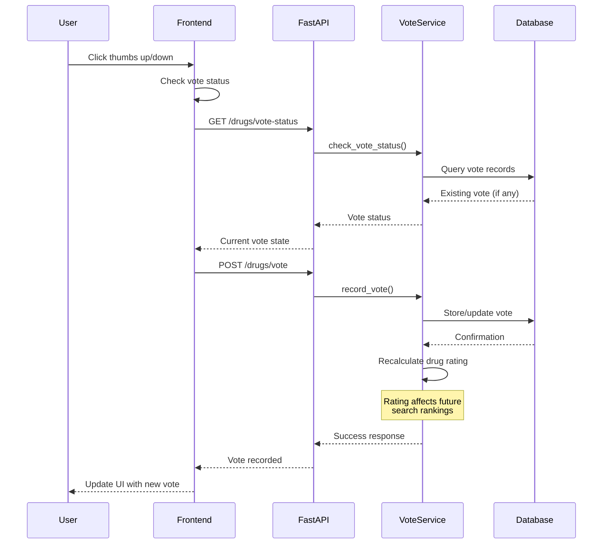
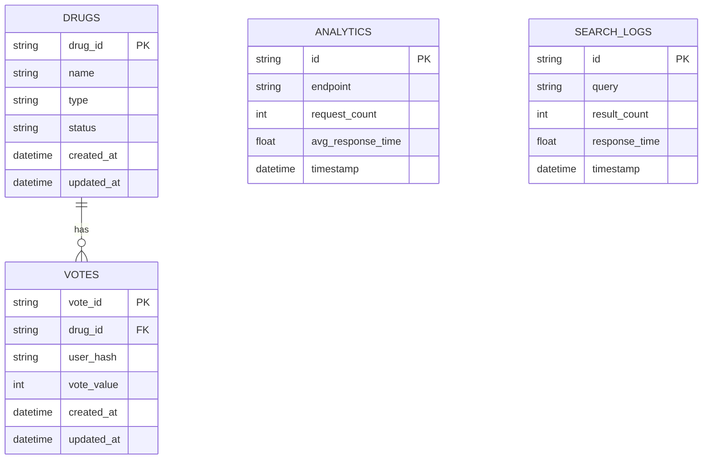

# RxVerify Architecture

> **Technical architecture and system design for RxVerify - Modern Drug Search & Self-Improving Analytics Platform**

## 🏗️ System Architecture Overview

RxVerify is a modern, production-ready drug search system featuring intelligent ranking, user-driven feedback, and real-time analytics. It combines a curated MongoDB database of 100,000+ drugs with sophisticated search algorithms and a self-improving voting system that learns from user preferences.

## 🔄 High-Level System Flow

## 🧠 Core Application Architecture

## 🔍 Drug Search Flow

## 🗳️ Voting System Flow

## 📊 Database Architecture

## 🎯 Key Components

### Frontend (Vanilla JavaScript)
- **Drug Search Interface**: Debounced search input with real-time results
- **Voting System**: Thumbs up/down buttons with optimistic updates
- **Admin Dashboard**: Real-time metrics and analytics
- **WebSocket Integration**: Live updates for admin dashboard

### Backend (FastAPI)
- **Drug Search API**: Intelligent ranking with multi-tier scoring
- **Vote Management**: Anonymous tracking with IP + User Agent hash
- **Analytics Engine**: Performance metrics and search analytics
- **WebSocket Server**: Real-time updates for connected clients

### Database Layer
- **MongoDB Atlas** (Primary): 100,000+ drugs, vote records, analytics
- **SQLite** (Fallback): Local development and testing
- **Analytics Database**: Search logs, performance metrics

### Search Algorithm
1. **Prefix Matching**: Drugs starting with query get highest priority
2. **Single Drug Priority**: Single drugs ranked above combinations
3. **Vote Integration**: Vote scores add/subtract ranking points
4. **Auto-Hiding**: Poorly rated drugs (rating ≤ -0.5, 3+ votes) filtered out

## 🔐 Security & Privacy

- **Anonymous Tracking**: IP + User Agent hash (no personal data)
- **CORS Protection**: Configurable allowed origins
- **Rate Limiting**: Built-in FastAPI rate limiting
- **Input Validation**: Pydantic models for all requests

## 📈 Performance Optimizations

- **Database Indexing**: Optimized indexes on drug names and IDs
- **Caching**: In-memory caching for frequently accessed data
- **Debounced Search**: 300ms debounce on frontend search input
- **Lazy Loading**: Results loaded incrementally
- **Connection Pooling**: Efficient database connection management

