# RxVerify Architecture Documentation

> **Comprehensive technical architecture and system design for RxVerify - Multi-Database Drug Assistant**

## 🏗️ **System Architecture Overview**

RxVerify is built as a modern, production-ready Retrieval-Augmented Generation (RAG) system that combines vector search, AI-powered responses, and multi-source drug data validation.

## 🔄 **High-Level System Flow**

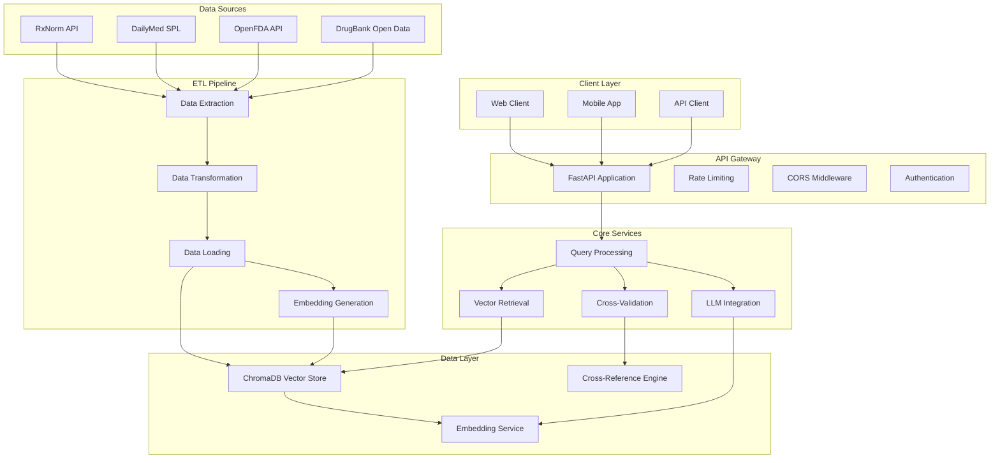

## 🧠 **Core Application Architecture**

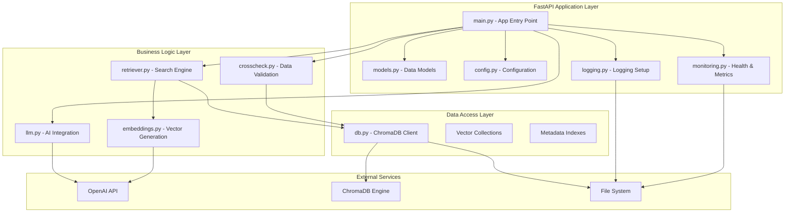

## 🔍 **Query Processing Flow**

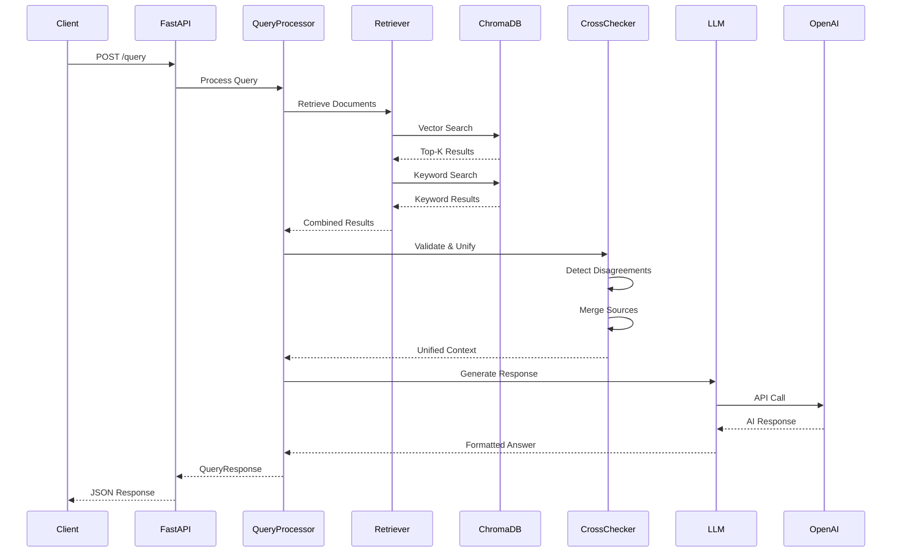

## 🗄️ **Data Architecture & Storage**

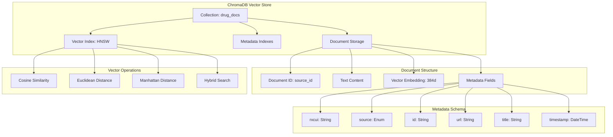

## 🔄 **ETL Pipeline Architecture**

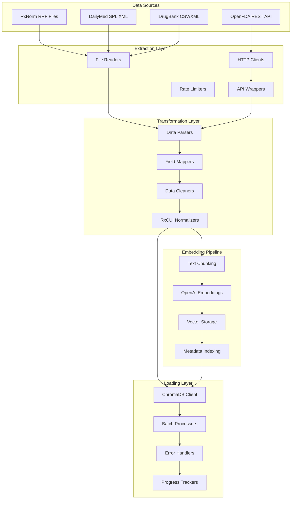

## 🔐 **Security & Access Control**

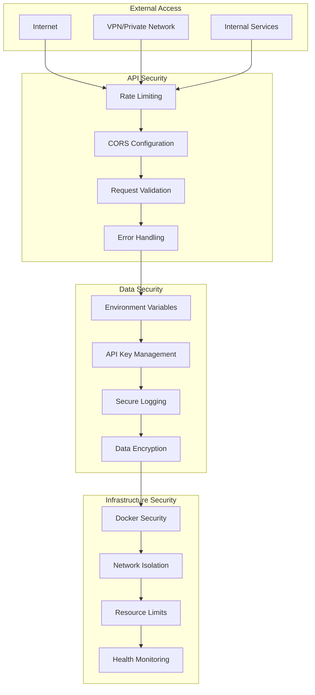

## 📊 **Monitoring & Observability**

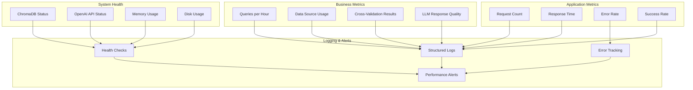

## 🚀 **Deployment Architecture**

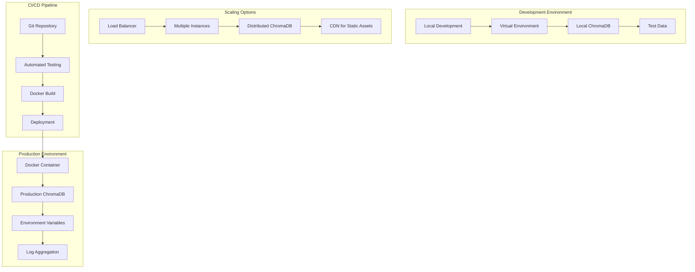

## 🔧 **Component Dependencies**

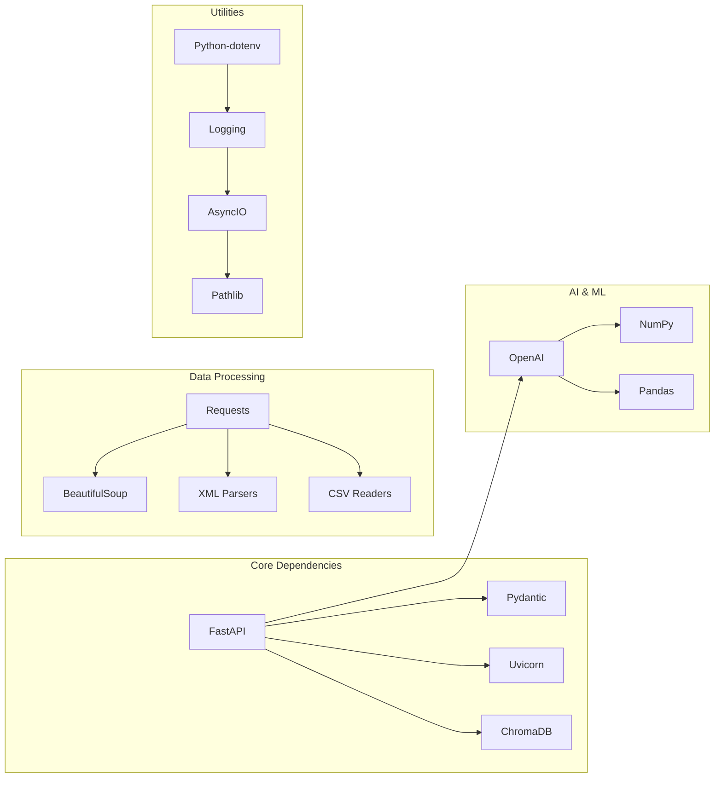

## 📈 **Performance Characteristics**

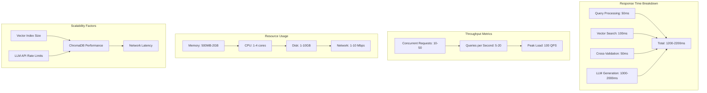

## 🔄 **Data Flow Patterns**

```mermaid
graph TB
    subgraph "Read Pattern"
        A[Query Request]
        B[Vector Search]
        C[Result Ranking]
        D[Context Assembly]
        E[Response Generation]
    end
    
    subgraph "Write Pattern"
        F[Data Ingestion]
        G[Text Processing]
        H[Embedding Generation]
        I[Vector Storage]
        J[Metadata Indexing]
    end
    
    subgraph "Update Pattern"
        K[Data Refresh]
        L[Incremental Updates]
        M[Version Management]
        N[Rollback Capability]
    end
    
    subgraph "Delete Pattern"
        O[Data Archival]
        P[Soft Deletes]
        Q[Cleanup Jobs]
        R[Storage Optimization]
    end
    
    A --> B
    B --> C
    C --> D
    D --> E
    
    F --> G
    G --> H
    H --> I
    I --> J
    
    K --> L
    L --> M
    M --> N
    
    O --> P
    P --> Q
    Q --> R
```

## 🎯 **Key Design Principles**

### **1. Separation of Concerns**
- **API Layer**: Handles HTTP requests, validation, and responses
- **Business Logic**: Manages drug data processing and AI integration
- **Data Layer**: Handles storage, retrieval, and vector operations
- **Infrastructure**: Manages configuration, logging, and monitoring

### **2. Async-First Design**
- All I/O operations are asynchronous
- Non-blocking API endpoints
- Efficient resource utilization
- Scalable request handling

### **3. Fault Tolerance**
- Graceful degradation when services are unavailable
- Comprehensive error handling and logging
- Fallback mechanisms for critical failures
- Health checks and monitoring

### **4. Data Consistency**
- Cross-source validation and unification
- Conflict detection and reporting
- Source attribution and citations
- Audit trail for all operations

### **5. Performance Optimization**
- Vector similarity search for semantic matching
- Hybrid search combining vector and keyword approaches
- Efficient data structures and indexing
- Caching strategies for frequently accessed data

## 🔮 **Future Architecture Considerations**

### **Scalability Enhancements**
- **Distributed ChromaDB**: Multi-node vector database clusters
- **Load Balancing**: Multiple API instances behind a load balancer
- **Caching Layer**: Redis for frequently accessed data
- **CDN Integration**: Static asset delivery optimization

### **Advanced Features**
- **Real-time Updates**: WebSocket support for live data updates
- **Advanced Analytics**: Query analytics and usage patterns
- **Multi-tenant Support**: Isolated data spaces for different organizations
- **API Versioning**: Backward-compatible API evolution

### **Integration Capabilities**
- **GraphQL API**: Flexible query interface
- **Webhook Support**: Real-time notifications
- **Third-party Integrations**: EHR systems, pharmacy software
- **Mobile SDKs**: Native mobile application support

---

*This architecture document provides a comprehensive view of the RxVerify system design. For implementation details, refer to the individual component documentation and source code.*
